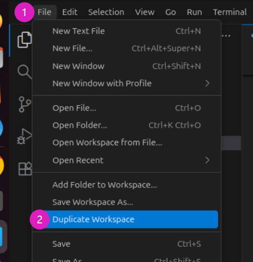
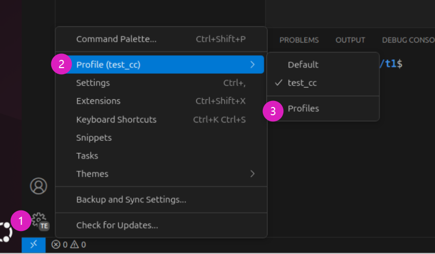

+++
date = '2025-10-15T22:58:56+08:00'
title = '多个vscode窗口打开同一个目录文件夹'
+++
1. File->Duplicate Workspace 复制一个工作区, 会打开个新窗口 
 

2. 左下角**齿轮**->Profile->Profiles新建一个配置,然后选择 
 

3. 这个新vscode窗口的插件配置是独立的, 可以用来进行各种插件试用和测试

